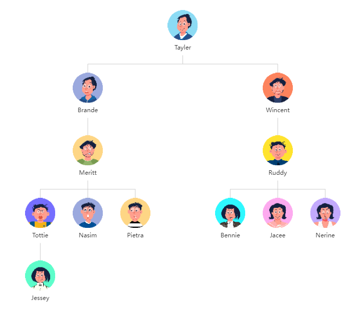

## 效果图



## 下载

```
npm i vue-org-chart-plugin echarts@5.3.2
```

## 使用

### Vue 2.x

// main.js
```javascript
import Vue from 'vue'
import App from './App.vue'
import orgChart from 'vue-org-chart-plugin'

Vue.use(orgChart)

Vue.config.productionTip = false

new Vue({
  render: h => h(App),
}).$mount('#app')
```

// Foo.vue
```html
<v-org-chart :options='orgChartOptions'></v-org-chart>

<script>
export default {
  name: "App",

  data() {
    return {
      orgChartOptions: {
        tooltip: {

          // 节点的值，在 tooltip 中显示。
          value: {
            Position: 'mock',
            Email: 'mock@mock.com'
          },
        },

        avatar: {

          // 头像
          value: 'http://127.0.0.1:8080/assets/avatar/avatar001.png',
        },

        text: {

          // 文本
          value: 'Tayler',
        },

        children: [
          {
            avatar: {
              value: 'http://127.0.0.1:8080/assets/avatar/avatar003.png',
            },
            text: {
              value: 'Brande',
            },
            children: [ /* ... */ ]
          },
          // ...
        ]
      }
    };
  },
};
</script>
```

### Vue 3.x

// main.js
```javascript
import { createApp, h } from 'vue'
import App from './App.vue'
import orgChart from 'vue-org-chart-plugin'

const app = createApp(App)
app.use(orgChart, app, h)
app.mount('#app')
```
// Foo.vue
```html
<v-org-chart :options='orgChartOptions'></v-org-chart>

<script>
export default {
	data () {
    return {
      orgChartOptions: {
        // ...
      } 
    }
  }
}
</script>
```

## 自定义全局配置项

```javascript
orgChartOptions: {
  globalStyle: {
    tooltip: {
      // ...
    },
    series: [
      {
        // ...
      }
    ]
  }
}
```

### tooltip

```javascript
tooltip: {
      
  // 是否显示提示框
  show: true, // false

  // 是否显示提示框浮层，默认显示。只需tooltip触发事件可配置该项为false。
  showContent: true, // false

  // 是否永远显示提示框内容，默认情况下在移出可触发提示框区域后一定时间后隐藏。
  alwaysShowContent: false, // true

  // 提示框触发的条件
  triggerOn: 'mousemove|click', // mousemove click

  // 鼠标是否可进入提示框浮层中，默认为false，如需详情内交互，如添加链接，按钮，可设置为true。
  enterable: false, // true

  // 是否将 tooltip 框限制在图表的区域内。当图表外层的 dom 被设置为 'overflow: hidden'，
  // 或者移动端窄屏，导致 tooltip 超出外界被截断时，此配置比较有用。
  confine: false, // true

  // 提示框浮层的背景颜色。
  backgroundColor: '#fff',

  // 提示框浮层的边框颜色。
  borderColor: '#ccc',

  // 提示框浮层的边框宽。
  borderWidth: 1,

  // 提示框浮层内边距，单位px，默认各方向内边距为 5 ，接受数组分别设定上右下左边距。
  padding: 5, // 设置内边距为 5
  // padding: [5, 10] // 设置上下的内边距为 5，左右的内边距为 10
  // 分别设置四个方向的内边距
  // padding: [ 
  //     5,  // 上
  //     10, // 右
  //     5,  // 下
  //     10, // 左
  // ]

  // 提示框浮层的文本样式。
  textStyle: {

    // 文本显示宽度。
    width: '100%', // 100% 200

    // 文本显示高度。
    height: '100%', // 100% 200

    // 文字的颜色。
    color: '#333',

    // 文字的字体大小。
    fontSize: 14,

    // 文字字体的粗细。
    fontWeight: 'normal', // bold bolder lighter

    // 文字超出宽度是否截断或者换行。配置width时有效
    overflow: 'none', // truncate break breakAll

    // 在overflow配置为'truncate'的时候，可以通过该属性配置末尾显示的文本。
    ellipsis: '...'
}
```

### series

```javascript
series: [
  {
    
    // 树图中正交布局的方向，也就是说只有在 layout = 'orthogonal' 的时候，该配置项才生效。
    orient: 'TB', // BT LR RL

    // 边的形状。分别有曲线和折线两种
    edgeShape: "polyline", // curve

    // 是否开启鼠标缩放和平移漫游。默认不开启。如果只想要开启缩放或者平移，
    // 可以设置成 'scale' 或者 'move'。设置成 true 为都开启
    roam: false, // true scale move

    // 子树折叠和展开的交互，默认打开。
    expandAndCollapse: true, // false

    // 树图初始展开的层级（深度）。根节点是第 0 层，然后是第 1 层、第 2 层，... ，直到叶子节点。
    // 如果设置为 -1 或者 null 或者 undefined，所有节点都将展开。
    initialTreeDepth: 5, // 初始化时展开层数

    // 定义树图边的样式。
    lineStyle: {

      // 树图边的颜色。
      color: '#ccc',

      // 树图边的宽度。
      width: 1
    }
  }
]
```

## 自定义局部配置项

```javascript
orgChartOptions: {
  tooltip: {
    value: {}, // 或者字符串
    style: {
      // ...
      textStyle: { /* ... */ }
		}
  },
  avatar: {
    value: '',
    style: {}
  }，
  text: {
    value: {},
    style: {}
  }
}
```

### tooltip

```javascript
tooltip: {
	value: {},
	style: {
	
		// 参考全局配置项中的tooltip
    backgroundColor: mock,

    borderColor: mock,

    borderWidth: mock,

    padding: mock,

    textStyle: {
      color: mock,

      fontWeight: mock,

      fontSize: mock,

      width: mock,
      
      height: mock,

      overflow: mock,

      ellipsis: mock
    }
	}
}
```

### avatar

```javascript
avatar: {

	// 头像图片地址，当值为 null / undefined 时，会用背景色占位。
	value: mock,
    
	style: {
	
		// 头像高度
		height: 60,

		// 头像宽度
    width: 60,

		// 头像圆角半径
    borderRadius: 50,
	}
}
```

### text

```javascript
text: {
  
  // 头像下方文本内容
	value: mock,
    
  style: {
    
		// 文字字体的颜色。
    color: '#333',

    // 文字字体的粗细。
    fontWeight: 'normal', // bold bolder lighter

    // 文字的字体大小。
    fontSize: 12,

    // 文字块背景色。
    backgroundColor: '#fff', // transparent
  }
}
```

